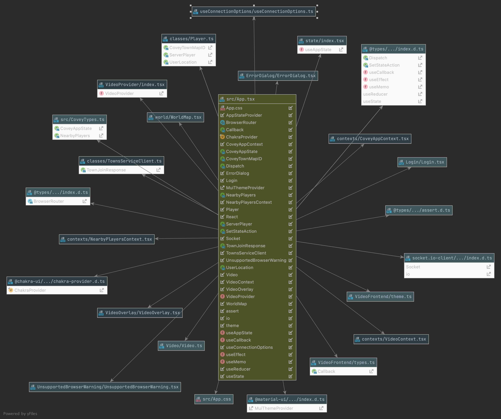
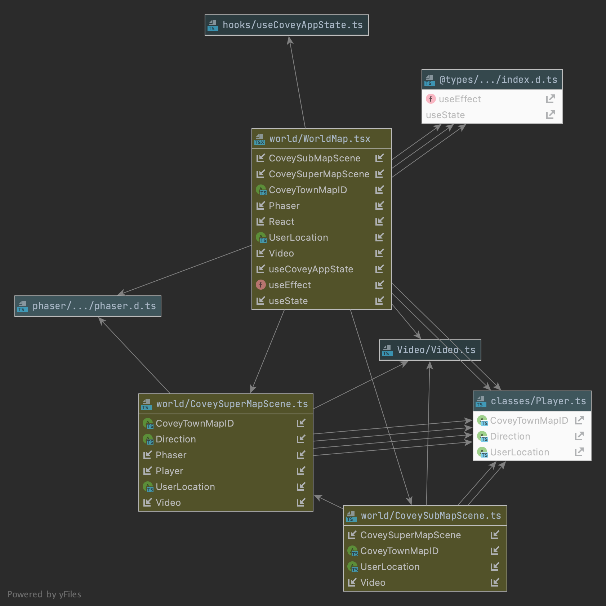

<!--RUBRIC DESIGN.MD
WHAT: DESIGN.md file contains a description of any substantive changes
to the existing Covey.Town codebase, and the architecture of your new code.
HOW: It uses CRC cards, or state diagrams or any of the other techniques
that help describe the structure.
Page requirement: max 4 pages.
-->

# Design
<!--Design Intro Outline
1.Intro to doc
2.quick overview of our design and motivation
    -what themes did we want:
        -make use of current functionality to our advantage
        -make our code/application extensible
3.quick explanation how we broke up our DESIGN.md doc
-->
### Planning and Approach
In our initial planning phase, we brainstormed different features to create create for Covey.Town and felt that submaps would be a great feature to implement.  We tried our best to follow certain themes in our approach:

1. make use of the current functionality to our advantage
2. make our code/feature extensible such that it could have a lifecycle that could be continued after this project ends and more features can be created upon ours.

Given our constraints such as a short timeline, coming into a codebase that we haven’t seen before, and learning the regular curriculum, we felt our submaps feature aligned with our approach and requirements for the project.

We explored the WorldMap class (WorldMap.tsx) and the CoveyGameScene class (inside the WorldMap.tsx) and spent a considerable amount of time reviewing/discussing the flow of the current application.  We realized that there was current functionality we could tap into and felt we would want to make the following changes:
1. WorldMap.tsx → move CoveySuperMapScene class (formally CoveyGameScene) our of this file and  into it’s own file.
2. Create a new class and separate file, CoveySubMapScene, that would extends CoveySuperMapScene

### This resulted in the following changes and purposes:
1. WorldMap.tsx : WorldMap will be the class that contains functionality for our SuperMap and for our SubMap(s).  The function, createMapScene, which is responsible in creating the map in either the the Super or Submap is declared here.  If the currentMapID is a 0, then it refers to the SuperMap, if it is a, 1, then this will refer to the Submap.  We will continue to use this 0 and 1 methodology to help the avatar shift easily between Super and Sub maps.
2. CoveySuperMapScene.ts: This class was formally known as CoveyGameScene and changed to CoveySuperMapScene and moved to a separate file.  Our approach in looking at this file was, to refactor where needed, but to extend functionality from this map to the Submap.  We needed our two separate maps to be able to have the same properties so they could speak the same language to each other.
3. CoveySubMapScene.ts:  Within the CoveySubMapScene, we take care of all our subMap functionality.  Previously, we thought we may need many functions here, but realized, this would create a lot of code duplication.  The CoveySubMapScene extends CoveySuperMapScene, so we realized that the superMap can deal with a lot of the logic.  The main difference is the subMap class will just preload the actual subMap file, while the superMap will deal with any heavy lifting.

We will go through the rest of the design by breaking this into sections of: Front-end: App.tsx, Front-end: WorldMap.tsx, CoveySuperMapScene.ts, CoveySubMapScene.ts, Reflections and Next-steps

# Front-end: App.tsx
<!--Front-end Outline (refer to Eric's doc inside our team folder 
CS5500 Group 41 > Deliverables > Design Notes.docx
1.App.tsx
1.1 State
1.2 Reducer
-->
## State
## Reducer

# Front-end: WorldMap.tsx, CoveySuperMapScene.ts, CoveySubMapScene.ts

## WorldMap.tsx

1. About WorldMap.tsx
    1. What we first saw when looking at WorldMap
2. How we imagined extensible design and created: CoveySuperMapScene and CoveySubMapScene
## CoveySuperMapScene.ts
1. About CoveySuperMapScene
2. Changing between scenes of Super--> Sub and Sub-->Super
## CoveySubMapScene.ts
1. About CoveySubMapScene

# State Changes (TBD)
1. Not sure if this is to be on it's own, OR will be discussed in the frontend:super/sub section.  Placed it here, since we discussed this section on Thurs. Feel free to modify.

# Reflections, Next-steps & Conclusion
## Production code we did not use:
1. List code we didn't include from production code base
2. We did not use transporter code. 
    - we made changes to our code by the time we saw the transporter code update and had 
     to comment the update to make sure it did not interact with our current feature 
     we were building.
    - List any other reasoning
3. Sprite fix (in upper left) update
    - updated code from Professor used the same naming convention for a field we
      already had in use.
    - So we can explain what we did.

## Next-steps & Conclusion:
1. There were things that we had to intentionally leave for later that we could place into a Covey.Town v2 release
2. How did we handle issues outside of our use-cases?
   -We had a list in our meeting minutes and would have to
   prioritize if those issues were optional vs. required.
   -Tried our best to prioritize the use cases as outlined in our plan
3. What would we do for the v2 release:
   -incorporate the transporter code.
   -spawn relocation for avatar from Submap->SuperMap, so it goes to entrance
   -(anything else)
4. Close-out section
