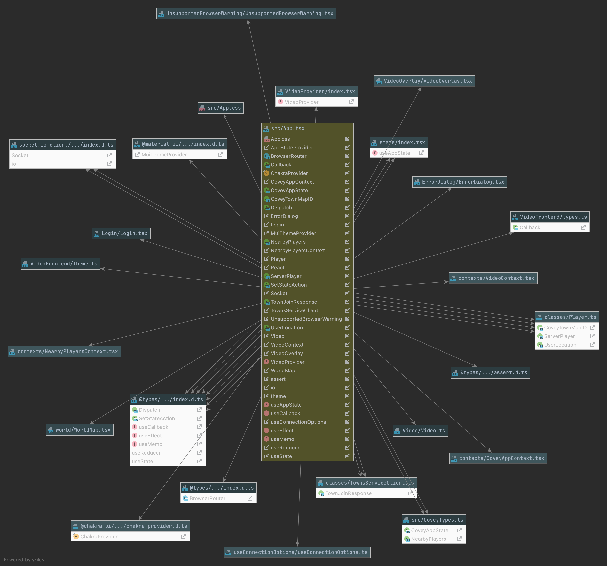
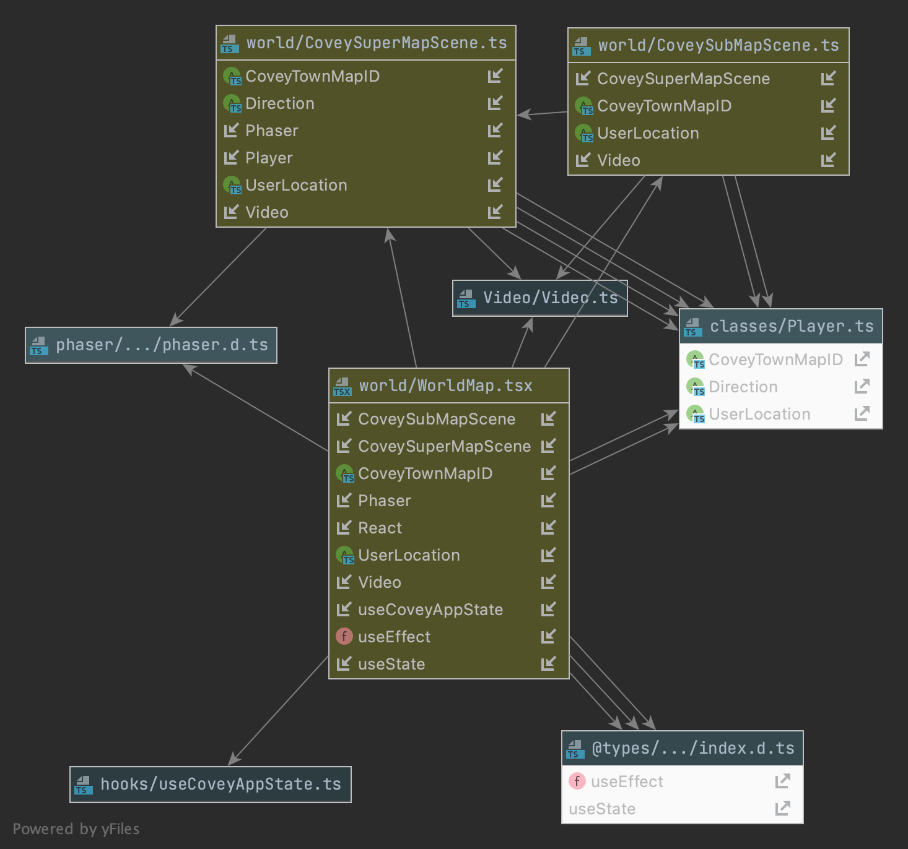
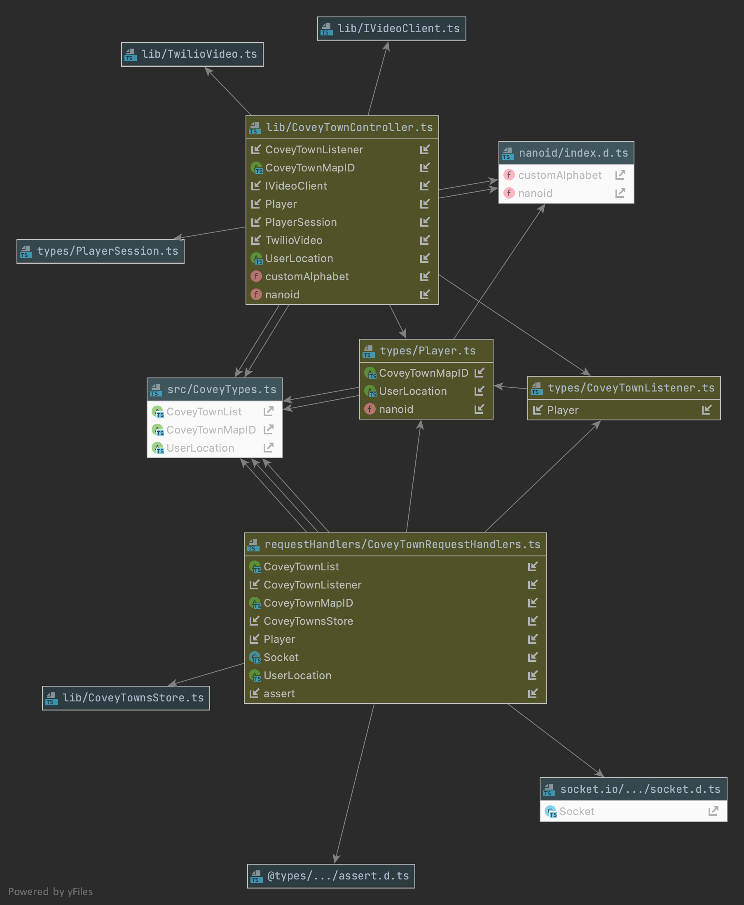

<!--RUBRIC DESIGN.MD
WHAT: DESIGN.md file contains a description of any substantive changes
to the existing Covey.Town codebase, and the architecture of your new code.
HOW: It uses CRC cards, or state diagrams or any of the other techniques
that help describe the structure.
Page requirement: max 4 pages.
-->

# Design
<!--Design Intro Outline
1.Intro to doc
2.quick overview of our design and motivation
    -what themes did we want:
        -make use of current functionality to our advantage
        -make our code/application extensible
3.quick explanation how we broke up our DESIGN.md doc
-->
### Planning and Approach
In our initial planning phase, we brainstormed different features to create for Covey.Town and felt that submaps would be a great feature to implement.  We tried our best to follow certain themes in our approach:

1. make use of the current functionality to our advantage
2. make our code/feature extensible such that it could have a lifecycle that could be continued after this project ends and more features can be created upon ours.

Given our constraints such as a short timeline, coming into a codebase that we haven’t seen before, and learning the regular curriculum, we felt our submaps feature aligned with our approach and requirements for the project.

We explored the WorldMap class (WorldMap.tsx) and the CoveyGameScene class (inside the WorldMap.tsx) and spent a considerable amount of time reviewing/discussing the flow of the current application.  We realized that there was current functionality we could tap into and felt we would want to make the following changes:
1. WorldMap.tsx → move CoveySuperMapScene class (formerly CoveyGameScene) out of this file and  into it’s own file.
2. Create a new class and separate file, CoveySubMapScene, that would extends CoveySuperMapScene

### This resulted in the following changes and purposes:
1. WorldMap.tsx : WorldMap will be the class that contains functionality for our SuperMap and for our SubMap(s).  The function, createMapScene, which is responsible in creating the map in either the the Super or Submap is declared here.  If the currentMapID is a 0, then it refers to the SuperMap, if it is a, 1, then this will refer to the Submap.  We will continue to use this 0 and 1 methodology to help the avatar shift easily between Super and Sub maps.
2. CoveySuperMapScene.ts: This class was formerly known as CoveyGameScene and changed to CoveySuperMapScene and moved to a separate file.  Our approach in looking at this file was, to refactor where needed, but to extend functionality from this map to the Submap.  We needed our two separate maps to be able to have the same properties so they could speak the same language to each other.
3. CoveySubMapScene.ts:  Within the CoveySubMapScene, we take care of all our subMap functionality.  Previously, we thought we may need many functions here, but realized, this would create a lot of code duplication.  The CoveySubMapScene extends CoveySuperMapScene, so we realized that the superMap can deal with a lot of the logic.  The main difference is the subMap class will just preload the actual subMap file, while the superMap will deal with any heavy lifting.

We will go through the rest of the design by breaking this into sections of: Front-end: App.tsx, Front-end: WorldMap.tsx, CoveySuperMapScene.ts, CoveySubMapScene.ts, Reflections and Next-steps

# Front-end: App.tsx
<!--Front-end Outline (refer to Eric's doc inside our team folder 
CS5500 Group 41 > Deliverables > Design Notes.docx
1.App.tsx
1.1 State
1.2 Reducer
-->
## State
#### New Attributes Added
1. currentMapID: maintains the player’s current map. Used to determine which scene to render and which players to make visible 
    - Collaborator classes/functions
        - WorldMap
        - CoveySuperMapScene 
        - CoveySubMapScene
2. emitMapChange: function which triggers the socket to emit a ‘playerMigrated’ event
    - Collaborator classes/functions
        - WorldMap
        - CoveySuperMapScene 
        - CoveySubMapScene
## Reducer Actions
1. New
    - playerMapChanged: triggered when a ‘playerMapChanged’ action is received by the socket
        - Updates the map of the player who migrated and recalculates nearby players
    - weMapChanged: triggered when the current player migrates (emitMapChanged)
        - Updates the currentMapID in the state and recalculates nearby players
2. Updated
    - playerMoved: also update the mapID of the player
        - This change was made because often a player moving and changing maps happens simultaneously. In this case, because actions are not synchronous, the players array returned by playerMoved may overwrite the players array returned by playerMapChanged. Updating mapID in both actions ensures we always get the correct mapID from the backend

# Front-end: WorldMap.tsx, CoveySuperMapScene.ts, CoveySubMapScene.ts

## WorldMap.tsx

1. Updates:
    - CoveySuperMapScene (formerly CoveyGameScene) moved to it's own 
    file. This was done to prevent circular dependency error caused
    by importing CoveySubMapScene, which extends CoveySuperMapScene, 
    into the file where its super-class is defined. 
    - CoveySuperMapScene and CoveySubMapScene classes now imported
    - createMapScene function added to dynamically create the required
    scene based on the player's current CoveyTownMapID
    - WorldMap function updated to extract emitMapChange and
    currentMapID from the App state. New game scene is now collected
    from the createMapScene function instead of directly instantiated. 
    Additional dependencies added to useEffect hooks to run on map change.
## CoveySuperMapScene.ts
1. This class now serves as the main map class where common functionality
between map types (player movement, sprite management, rendering, etc.) is
defined. New map types (e.g., CoveySubMapScene) can extend from this class to
take advantage of this functionality.   
2. Updates:
    - Formerly CoveyGameScene, renamed to be more descriptive of new
    design paradigm
    - Definition moved to its own file to prevent circular dependency 
    issues with extending classes
    - tileMap, currentMapID, emitMapChange, and map properties added
    - emitMapChange function and mapID added to constructor
    - function added to transfer player to handle player transfer to new
    map
    - mapID added to player constructor calls
    - player mapID is set in the updatePlayerLocation function
    - sprite recovery added to updatePlayerLocation function
    - sprite visibility toggled by mapID in updatePlayerLocation function
    - Door object embedded in map to act as a trigger for map change event

## CoveySubMapScene.ts
1. This class extends the CoveySuperMapScene class, and includes functionality
specific to the sub-map.
    - currently, major differences only include asset definitions, which are
    used to render the specific tilesets and collisions for the sub-map, and
    overriding the transfer function to send the player back to the super-map
    when a transfer event is triggered. 
    - additional functionality can be added to this class as desired to
    introduce new features to the sub-maps without needing to modify the CoveySuperMapScene class. 

# Back-end: roomService

Changes for the backend roomService handle the players moving between maps. 
Ensuring that all player map locations are tracked and events are broadcast to other players.
## Player.ts
1. Add mapID to hold the value of the player's current map id

## CoveyTownRequestHandlers.ts
1. Add a socket emission for 'playerMigration' event in the townSubscriptionHandler
2. Include 'playerMapChanged' handler in townSocketAdapter

## CoveyTownListener.ts
1. Add new listener function, onPlayerMapChanged

## CoveyTownController.ts
1. Add function updatePlayerMap which updates a player's map id and broadcasts the change to all listeners

## Testing
1. CoveyTownsStore.test.ts: add onPlayerMapChanged to the listener
2. CoveyTownController.test.ts: add tests to confirm notification of listeners to player migrations between maps
3. CoveyTownSocket.test.ts: test that the socket dipatches map migration updates to other player listeners

# Additional Design Comments
During the length of the project, items naturally arose in which we had to discuss as a group if they were to be 
addressed now vs. later.  We tried our best to stick to the project plan we created at the beginning of the project,
while weighing in on the "now vs. later" items.  Some of these items were outside the scope of our use cases and what
we set out to do.  While some may be more UI based and felt it could be addressed in perhaps a Covey.Town v2 release.
We felt it important to list what we left for later and some rationale behind that:
1. We did not use transporter code from the Professor's Covey.Town repo. 
    - By the time the transporter code came out, we already created new code based on Covey.Town looked prior to the transporter code.
      Since we already started creating, planning, and building before it was released, we felt commenting it out was for the best. 
    - Our feature update and use-cases relate to avatar movement, so we did not want any cross-feature update to interfere with our work.
      So we commented it out, however, this can be included later on if desired.  
2. Spawn relocation from SubMap-> SuperMap.
   - When the avatar goes from the SubMap to the SuperMap, it will spawn back at the SuperMap spawnpoint instead of spawning by the doorway of the building you entered in the SuperMap. 
     This is an item that is more UI and something and while we wanted to work on this, we felt that we should spend our time focused on the use-cases and if we have time to work on later.
   - In the next release, if you include the transporter code, then the spawn relocation becomes less of an issue as you can utilize the transporter functionality to traverse the map.

