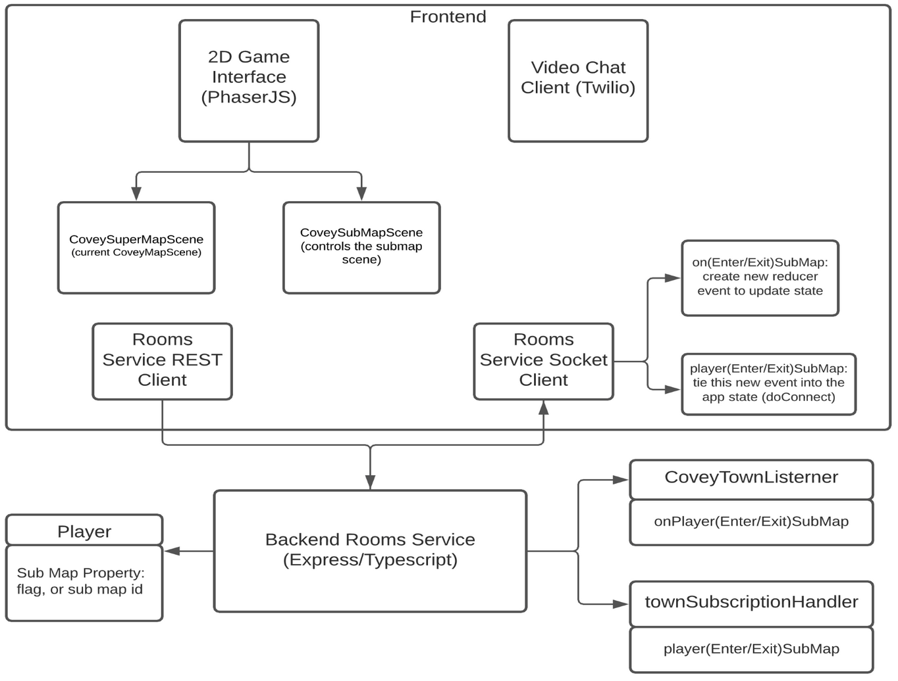
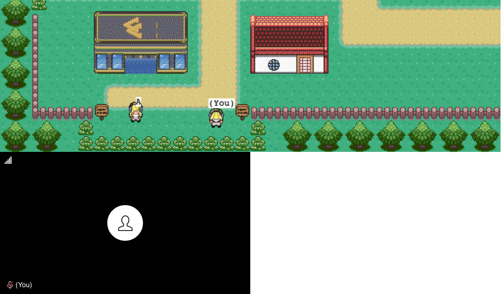
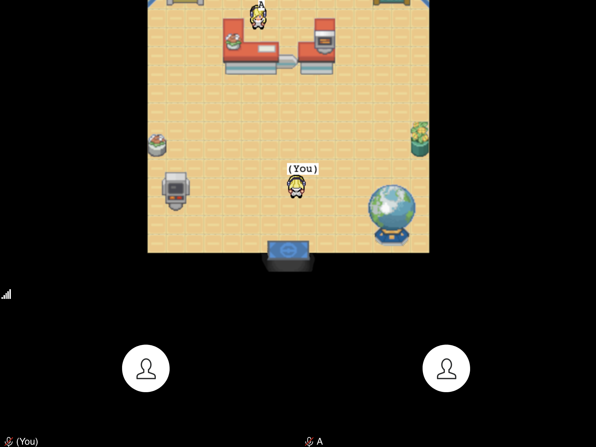

# Covey.Town

Covey.Town provides a virtual meeting space where different groups of people can have simultaneous video calls, allowing participants to drift between different conversations, just like in real life.    Covey.town is a virtual collaborative meeting space.  Simply log into Covey.Town and meet with different groups of people via video chat and enjoy different conversations from all over the world.  Online meetings are plagued with not giving an authentic feel of a real-life conversation.  We would like to merge the way real life conversations happen every day and the way digital conversations happen, into a more unified experience.  We hope covey.town is a great start to help do this.

Currently, online conversations do not mimic how easy it is to talk to people in real life.  You have to log in, find their number, call them, to talk to them.  Chatrooms on the other hand, allow users to idle and converse amongst people you haven’t met before.  This can be a lengthy process to start a conversation online.  It’s still not as easy as walking up to somebody and starting a conversation.

We are hoping to fix some of these issues, by creating submaps in covey.town.  Submaps would allow you to enter a smaller map, such as a point of interest (POI) and walk inside a P.O.I. create new experiences with people you meet on covey.town.  Now you and a friend (or someone you just met) can enter a virtual library together, stores, parks, building, just like in real life.  We are hoping to mimic the real-life experience with this digital experience, by introducing the feature, submaps. 

You can view our reference deployment of the app at [https://lucid-hopper-1f156f.netlify.app/](https://lucid-hopper-1f156f.netlify.app/).

Our GitHub Repository is at [https://github.com/eric-benny/covey.town/](https://github.com/eric-benny/covey.town/).
# Covey.Town Architecture with Submap functionality

The figure above depicts the high-level architecture of Covey.Town with our new feature, submaps.
The frontend client (in the `frontend` directory of this repository) uses the [PhaserJS Game Library](https://phaser.io) to create a 2D game interface, using tilemaps and sprites.
The frontend implements video chat using the [Twilio Programmable Video](https://www.twilio.com/docs/video) API, and that aspect of the interface relies heavily on [Twilio's React Starter App](https://github.com/twilio/twilio-video-app-react).

A backend service (in the `services/roomService` directory) implements the application logic: tracking which "towns" are available to be joined, and the state of each of those towns.

# Submaps : Feature explanation
Lets walkthrough an brief example of our submap feature.  Let's say two friends enter a town, person A and person B:

1. Friend A is on the left and friend B is on the right.  You both have entered the main map, in our code, we refer to this as the superMap.
2. In the superMap, you can start a video conversation if your avatar physically close to another avatar.
3. Notice how there is only one black video box at the bottom, only if we move closer to friend A, will there be two black boxes.  Then we can start a video chat.
4. What if you just wanted to talk to everyone on the map at once ?  With our submaps feature, you can enter a building together and do just that.
5. To enter a building, all you have to do is walk up to door and be automatically transported to another map.  Let's take a look below.

1. Friend A headed inside and is waiting for us by the desk!  Friend B just walked in.
2. Now, friend A and B can talk to each other without having to be physically close to each other. All you have to do is enter a building, in our code we refer to this as our subMap.
3. Notice that at the bottom you see two black boxes for video chatting.  Now you can start talking and explore the room and also talk with multiple friends as they join.
4. This sums up our feature at a highlevel.  The only thing left is to invite all your friends and meet new ones and enjoy the feature of submaps!

## Running this app locally

Running the application locally entails running both the backend service and a frontend.

### Setting up the backend

To run the backend, you will need a Twilio account. Twilio provides new accounts with $15 of credit, which is more than enough to get started.
To create an account and configure your local environment:

1. Go to [Twilio](https://www.twilio.com/) and create an account. You do not need to provide a credit card to create a trial account.
2. Create an API key and secret (select "API Keys" on the left under "Settings")
3. Create a `.env` file in the `services/roomService` directory, setting the values as follows:

| Config Value            | Description                               |
| ----------------------- | ----------------------------------------- |
| `TWILIO_ACCOUNT_SID`    | Visible on your twilio account dashboard. |
| `TWILIO_API_KEY_SID`    | The SID of the new API key you created.   |
| `TWILIO_API_KEY_SECRET` | The secret for the API key you created.   |
| `TWILIO_API_AUTH_TOKEN` | Visible on your twilio account dashboard. |

### Starting the backend

Once your backend is configured, you can start it by running `npm start` in the `services/roomService` directory (the first time you run it, you will also need to run `npm install`).
The backend will automatically restart if you change any of the files in the `services/roomService/src` directory.

### Configuring the frontend

Create a `.env` file in the `frontend` directory, with the line: `REACT_APP_TOWNS_SERVICE_URL=http://localhost:8081` (if you deploy the rooms/towns service to another location, put that location here instead)

### Running the frontend

In the `frontend` directory, run `npm start` (again, you'll need to run `npm install` the very first time). After several moments (or minutes, depending on the speed of your machine), a browser will open with the frontend running locally.
The frontend will automatically re-compile and reload in your browser if you change any files in the `frontend/src` directory.
